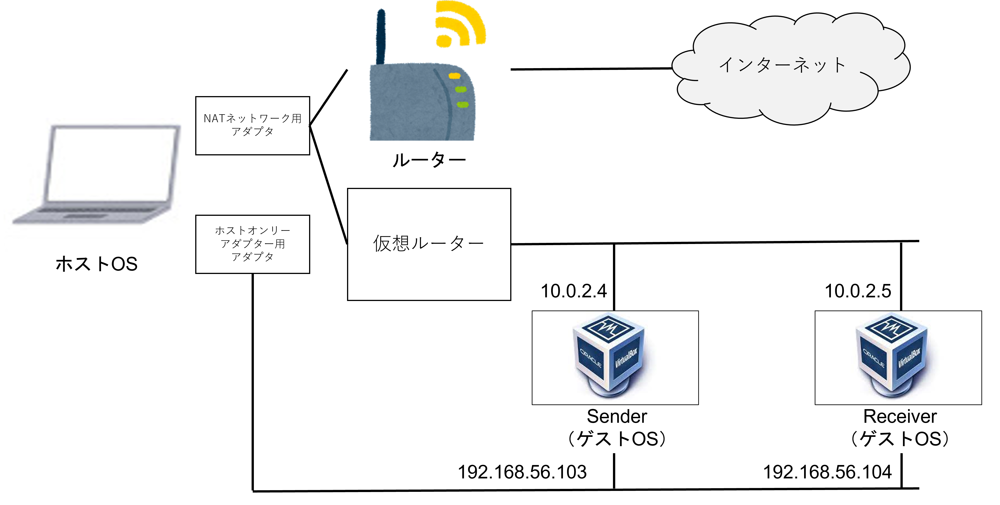

# TCP/UDP送受信検証手順

## 日付
2022-08-10

## ホストOSに必要なソフトウェア
* VirtualBox
* Windows Terminal
* WinSCP

※ 最新バージョンをお使い下さい。
※ WinSCPやWindows Terminalは必須ではありません。

## OS
[CentOS-7-x86_64-Minimal-2009.iso](https://ftp.riken.jp/Linux/centos/7.9.2009/isos/x86_64/CentOS-7-x86_64-Minimal-2009.iso)

## インストールパッケージ
* nc
* iproute
* tcpdump
* net-tools
* fallocate

※ yum install時の最新バージョンをお使い下さい。

## システム構成


## 事前準備

1. VirtualBoxでCentOSを構築
* 参考手順
[Windows10にVirtualBoxでcentos7環境を構築する](https://qiita.com/apricotcomic/items/035dc1c0c7ad08054495)

2. ネットワーク設定
* NATネットワーク：10.0.2.4/24（DHCPにより払い出し）
* ホストオンリーアダプター：192.168.56.103/24（固定。nmtui等で設定）
NATネットワークで、パッケージインストールやゲストOS間通信をし、ホストオンリーアダプターではホストOSからSSHで操作する際に使用しています。
IPアドレスは環境に応じて変更すること。

* 参考手順
  * [CentOSにSSH接続してみる！VirtualBoxのNATとホストオンリーアダプターによるネットワーク設定のベストプラクティス！〜安全かつ快適な開発ができるようにする〜](https://qiita.com/nooboolean/items/96ae44d0090794dce8d1)
  ※以下で、NATネットワークの設定をするため、上述の記事のNATの設定はしないこと。
  * [VirtualBoxのNATネットワークを使った開発環境を整える](https://buzz-server.com/tech/virtual-box-nat-network/)

3. パッケージインストール
```
[root@sender ~]# yum update
[root@sender ~]# yum install -y nc iproute tcpdump net-tools fallocate

※ SenderとReceiverの仮想マシンを両方で実施すること。
```

2. firewall無効
```
[root@sender ~]# systemctl stop firewalld.service
[root@sender ~]# systemctl disable firewalld.service

※ SenderとReceiverの仮想マシンを両方ともファイヤーウォール無効にすること。
```

3. データ作成
```
[root@sender ~]# fallocate -l 500MB 500MB.dat
```

4. 疎通確認
```
[root@sender ~]# ping 10.0.2.5
```

## 検証方法

### 送信端末から受信端末へTCPとUDPプロトコルを用いて、データサイズ500MBのメッセージを送信する。
　Windows Terminalで画面を4分割し、ホストOS、Senderコンテナ×2、Receiverコンテナにログインする。
```
[root@receiver ~]# はReceiverで操作しています。
[root@sender ~]# はSenderで操作しています。
$ ~ はホストOSで操作しています。
```

* TCP
1. [root@receiver ~]# nc -lk 10080 # tcpメッセージをリッスン
2. [root@sender ~]# tcpdump -Ai enp0s3 -tttt -nn tcp port 10080 -w /root/volume/tcp.pcap # tcpdumpでTCPパケットをキャプチャ
3. [root@sender ~]# nc 10.0.2.5 10080 < 500MB.dat # TCPメッセージを送信する。
4. root直下にtcp.pcapが出力されるので、WinSCP等でファイルをDLし、それをWiresharkで結果を確認

* UDP
1. [root@receiver ~]# nc -lu 10080 # udpメッセージをリッスン
2. [root@sender ~]# tcpdump -Ai eth0 -tttt -nn udp port 10080 -w /root/volume/udp.pcap # tcpdumpでUDPパケットをキャプチャ
3. [root@sender ~]# nc -u 172.20.0.3 10080 < 500MB.dat # UDPメッセージを送信する。
4. root直下にudp.pcapが出力されるので、それをWiresharkで結果を確認

### 送信端末側（Sender）でパケロスを一定の割合発生させ、送信端末から受信端末へTCPとUDPプロトコルを用いて、データサイズ500MBのメッセージを送信する。

* TCP
1. [root@receiver ~]# nc -lk 10080 # tcpメッセージをリッスン
2. [root@sender ~]# tcpdump -Ai enp0s3 -tttt -nn tcp port 10080 -w /root/volume/tcp.pcap # tcpdumpでTCPパケットをキャプチャ
3. [root@sender ~]# tc qdisc add dev enp0s3 root netem loss 10% # パケロスを10%するよう設定
4. [root@sender ~]# nc 10.0.2.5 10080 < 500MB.dat # TCPメッセージを送信する。
5. root直下にtcp.pcapが出力されるので、WinSCP等でファイルをDLし、それをWiresharkで結果を確認

* UDP
1. [root@receiver ~]# nc -lu 10080 # udpメッセージをリッスン
2. [root@sender ~]# tcpdump -Ai eth0 -tttt -nn udp port 10080 -w /root/volume/udp.pcap # tcpdumpでUDPパケットをキャプチャ
3. [root@sender ~]# tc qdisc add dev enp0s3 root netem loss 10% # パケロスを10%するよう設定
4. [root@sender ~]# nc -u 172.20.0.3 10080 < 500MB.dat # UDPメッセージを送信する。
5. root直下にudp.pcapが出力されるので、それをWiresharkで結果を確認

### 送信端末側（Sender）でパケットの順序を一定の割合変更し、送信端末から受信端末へCPとUDPプロトコルを用いて、テキストメッセージを送信する。

* TCP
1. [root@receiver ~]# nc -lk 10080 > test_data.txt # tcpメッセージをリッスン
2. [root@sender ~]# tcpdump -Ai enp0s3 -tttt -nn tcp port 10080 -w /root/volume/tcp.pcap # tcpdumpでTCPパケットをキャプチャ
3. [root@sender ~]# tc qdisc add dev enp0s3 root netem delay 10ms reorder 25% 50% # パケットの順序を変更する
4. [root@sender ~]# nc 10.0.2.5 10080 < test_data.txt # TCPメッセージを送信する。
5. root直下にtcp.pcapが出力されるので、WinSCP等でファイルをDLし、それをWiresharkで結果を確認

* UDP
1. [root@receiver ~]# nc -lu 10080 > test_data.txt # udpメッセージをリッスン
2. [root@sender ~]# tcpdump -Ai eth0 -tttt -nn udp port 10080 -w /root/volume/udp.pcap # tcpdumpでUDPパケットをキャプチャ
3. [root@sender ~]# tc qdisc add dev enp0s3 root netem delay 10ms reorder 25% 50% # パケットの順序を変更する
4. [root@sender ~]# nc -u 172.20.0.3 10080 < test_data.txt # UDPメッセージを送信する。
5. root直下にudp.pcapが出力されるので、それをWiresharkで結果を確認

test_data.txtは、以下のWebサイトより作成した。
[すぐ使えるダミーテキスト](https://lipsum.sugutsukaeru.jp/)

## 参考記事
* [lost and found ( for me ? )](https://lost-and-found-narihiro.blogspot.com/2010/10/linux-traffic-control.html)

* [tcコマンドの使い方](https://hana-shin.hatenablog.com/entry/2022/03/13/183444)

